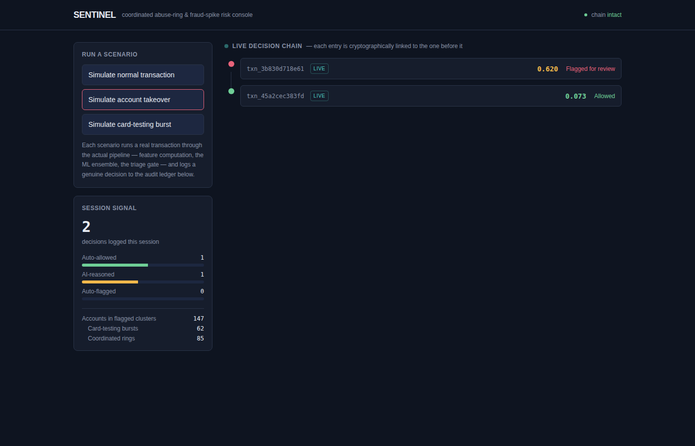
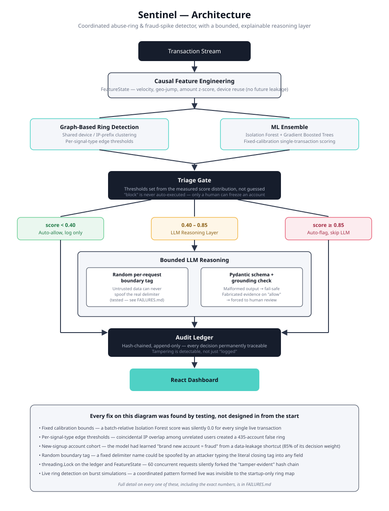

# Sentinel — Coordinated Abuse-Ring & Fraud-Spike Detector

Built for the Razorpay AI Buildathon 2026 — Track 02: AI Risk Manager.

## The problem

Razorpay's own framing for this track names "AI-enabled fraud hitting Indian BFSI"
as the reason it exists, and lists "Abuse-ring sentinel" as an example direction.
Independently, real merchant complaints (Trustpilot, consumer complaint boards)
show a recurring failure pattern: accounts get frozen for vague reasons with zero
evidence given, funds held for months, no audit trail the merchant can see.

Most fraud tools solve half the problem (catch bad transactions) and ignore the
other half (don't wrongly block good ones, and explain every decision). Sentinel
is built around both halves.

## What Sentinel does



*The live decision chain after two real simulated transactions — a
takeover attempt (risk 0.620, flagged for review) and an ordinary
purchase (risk 0.073, allowed). This is an actual screenshot of the
running app, not a mockup.*


1. **Detects coordinated fraud rings**, not just single suspicious transactions —
   bot-driven / AI-orchestrated attack clusters that share device fingerprints,
   IP proximity, and synchronized timing across nominally "unrelated" accounts.
2. **Scores individual transaction risk** using engineered behavioral features
   (velocity, geo-jump, amount z-score, device/card reuse).
3. **Routes only the ambiguous middle band** through a bounded LLM reasoning
   layer, which must output a structured evidence report — never a free-form
   decision. Obvious cases (very low or very high score) skip the LLM entirely
   — this is a deliberate design choice, not a limitation: it shows the system
   knows when NOT to spend an LLM call.
4. **Never auto-freezes an account outright.** High-risk clusters route to
   human review with the evidence trail attached. This directly targets the
   real complaint pattern found in research: accounts frozen with no
   explanation and no evidence.
5. **Reports the false-positive cost**, not just detection accuracy — the
   buildathon's own stated bar for this track.

## Architecture



Text version, for anyone viewing this without image rendering:

```
Synthetic Transaction Stream
        |
Feature Engineering (deterministic)
  - velocity, geo-jump distance, amount z-score, device/card reuse,
    time-of-day anomaly
        |
Graph Layer (ring detection)
  - cluster accounts by shared device fingerprint / IP proximity /
    synchronized transaction timing -> ring_id, ring_risk_score
        |
ML Detection Layer
  - Isolation Forest (unsupervised) + Gradient Boosted Trees (supervised)
  - ensemble -> calibrated probability
        |
Triage Gate (deterministic thresholds)
  - score < T1            -> auto-allow, log only
  - T1 <= score < T2       -> LLM reasoning layer
  - score >= T2            -> auto-flag for human review (never auto-block)
        |
LLM Reasoning Layer (Pydantic-bounded)
  - input: feature vector + ring context
  - output: MUST match schema {action: allow|review|block, confidence,
    evidence: [...], rationale}
  - malformed output -> deterministic fallback to "review" (fail-safe)
        |
Audit Ledger (append-only)
  - every decision fully traceable: features -> ML score -> LLM output ->
    validation result -> final status -> human override (if any)
        |
Dashboard (React)
  - live feed, ring visualizations, confusion matrix, false-positive
    cost tradeoff slider
```

## Repo layout

```
sentinel/
  backend/
    app/
      api/        FastAPI routes
      core/        config, state machine / triage gate
      agents/      LLM reasoning layer, prompt + schema enforcement
      schemas/     Pydantic models (zero-trust validation)
      services/    synthetic data generator, feature engineering, graph clustering
    tests/         benchmark + adversarial test suite
  frontend/         React + Tailwind dashboard
  data/             generated synthetic datasets
  FAILURES.md       running log of real failures hit during build (for the
                     "what broke and how you got out" submission question)
```

## How Sentinel fits Razorpay's own AI direction

Grounded in Razorpay's own public engineering output, not guesswork.

### A real protocol connection, not just an architectural claim

Razorpay's Agent Studio (launched March 2026) is built on Anthropic's
Claude Agent SDK + MCP (Model Context Protocol). Sentinel's own API is
mounted as real MCP tools (`backend/app/api/main.py`, via
`fastapi-mcp`) -- every risk-scoring and simulation endpoint is callable
directly by Claude or any MCP-compatible orchestrator today, the same way
an Agent Studio agent would call a tool. This was verified end-to-end,
not just wired up: the actual MCP handshake, tool listing, and a real
tool call (returning a genuine risk decision computed through the full
pipeline) all confirmed working -- see FAILURES.md for the version
conflicts found and fixed along the way.

### Sentinel already matches Razorpay's own stated Agent Studio principles

Razorpay launched Agent Studio in March 2026, built on Anthropic's Claude
Agent SDK, and published explicit design principles for agents on their
platform. Sentinel was built independently of that article -- the match
below is the same conclusion arrived at separately, not reverse-engineered
from it:

| Razorpay's stated principle | Sentinel's matching design |
|---|---|
| "No agent takes an irreversible action without explicit merchant approval" | Triage gate never auto-blocks -- always routes high-risk cases to human review |
| "Review-first mode: the agent does the work... holds it for the merchant to review" | The LLM-reasoned path, exactly |
| "Every action passes through a validation layer... scope checks... out-of-scope behavior detection" | Pydantic schema gate, deterministic fallback, and a grounding check on the LLM's own output (app/core/grounding_check.py) |
| "Every single action is logged with a full audit trail... what the agent did, when, and why" | Hash-chained, tamper-evident audit ledger |

### A binding regulatory hook, not a future trend

RBI's Authentication Mechanisms for Digital Payment Transactions
Directions, 2025 took effect April 1, 2026 -- mandating risk-based
authentication (calibrating security checks to each transaction's risk
profile) and making platforms liable for losses from security failures.
Razorpay is already operating under this requirement today.

### Positioned against what Razorpay has already built, not ignoring it

- **Thirdwatch** (acquired 2019): ML-based device fingerprinting and risk
  scoring. A scoring engine -- no structured, human-readable explanation
  layer for why a specific decision was made.
- **Chargeback Shield**: ML risk engine that also assumes financial
  liability for chargeback fraud.
- **Bumblebee** (Razorpay Engineering, Dec 2025): a multi-agent
  orchestrator for merchant onboarding risk review. Different surface
  area (pre-onboarding, not transaction-level), but it validates the same
  architectural philosophy Sentinel uses -- specialized layers instead of
  one monolithic model. Their own writeup: "the first architecture that
  works is rarely the architecture that scales."
- **Vulcan** (announced days before this was written): a new foundation
  model unifying routing, fraud, and checkout intelligence across
  Razorpay's network, including network-level fraud pattern detection
  across thousands of merchants.

Vulcan is a detection engine at a scale no buildathon project should try
to compete with. What Razorpay's own announcement of it does not describe
is an explainability or audit layer -- no mention of how a flagged
merchant or transaction gets a specific, evidence-backed reason, or how a
human reviewer's decision gets permanently logged. That is deliberately
Sentinel's actual niche: not a competing detection engine, but the
bounded, transparent reasoning and audit layer that could sit on top of
any detection signal -- its own ensemble, or a signal from something like
Vulcan.

## Build log / timeline

Original plan vs. what actually happened -- kept both rather than quietly
rewriting history:

- Aug 22: repo scaffold, synthetic data generator, feature engineering,
  graph-based ring detection, ML ensemble (all in one day, ahead of the
  original schedule)
- Aug 23: FastAPI backend, live single-transaction scoring, found and
  fixed a real data-leakage bug (account age) via live testing
- Aug 24: React dashboard, adversarial testing day -- found and fixed a
  concurrency race condition and a prompt-injection delimiter
  vulnerability
- Aug 26: Razorpay-specific research pass, positioning against Agent
  Studio/Bumblebee/Vulcan, scope-check addition on the LLM reasoning layer
- Aug 27-31: remaining polish, expanded adversarial coverage, write-up
- Sep 1-4: demo video, final README pass
- Sep 5: submit

(Timeline compressed and reprioritized on Aug 26 -- full build now targeted
for Aug 31 instead of Sep 3, giving more buffer before the Sep 5 deadline.)

## Results at a glance

Every real, measured number from this project -- ML precision/recall,
false-positive cost analysis, ring detection accuracy, and the full
21-test adversarial suite -- is consolidated in **[BENCHMARKS.md](BENCHMARKS.md)**.

To test the reasoning layer against the real Anthropic API (this build
environment has none, disclosed throughout `FAILURES.md`), run
`backend/tests/test_live_llm.py` locally with your own `ANTHROPIC_API_KEY`.

## Running it locally

**Backend** (from `backend/`):
```bash
pip install -r requirements.txt --break-system-packages
python -m app.services.data_generator     # generates data/*.csv
python -m app.services.features           # generates data/features.csv
python -m app.services.ring_detection     # generates data/ring_clusters_summary.csv
python -m app.services.ml_detection       # trains + saves models to app/core/trained_models/
uvicorn app.api.main:app --reload --port 8000
```
Visit `http://localhost:8000/docs` for interactive API docs.

To get real (not fallback) LLM reasoning, set your API key first:
```bash
export ANTHROPIC_API_KEY=sk-...   # macOS/Linux
$env:ANTHROPIC_API_KEY="sk-..."   # Windows PowerShell
```
Without a key, the reasoning layer's fail-safe fallback kicks in correctly
(routes to "review" instead of crashing or guessing) -- see FAILURES.md.

**Frontend** (from `frontend/`, in a separate terminal):
```bash
npm install
npm run dev
```
Visit `http://localhost:5173`. The dashboard polls the backend every 4
seconds and lets you trigger live scenarios (normal transaction, account
takeover, card-testing burst) via the control panel -- each one runs
through the real pipeline and appears in the live decision chain.

**Known low-priority item:** `npm audit` flags a moderate-severity advisory
in Vite's bundled esbuild (dev server only, not the production build --
allows cross-origin requests to the local dev server). Fixing it requires
a breaking upgrade to Vite 8 that hasn't been tested against this project.
Not a concern for local development/demo use.

**API rate limiting:** every endpoint that does real work is rate-limited
per client IP (20/minute on simulate endpoints, 10/minute on the burst
endpoint, 60/minute on reads) -- see `backend/app/api/rate_limit.py` for
the exact limits and an explicit note on what this covers (naive
single-source hammering) and doesn't (it isn't authentication, and isn't
a substitute for a real gateway in a production deployment).
